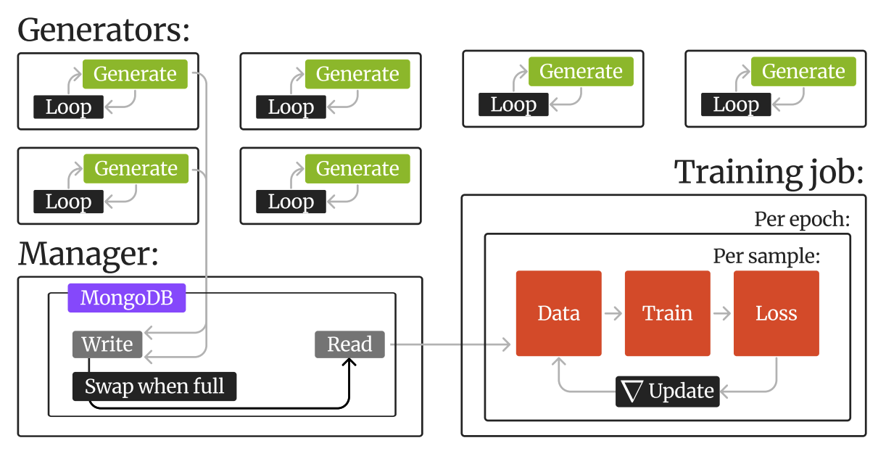

# Wirehead #

Caching system for scaling of synthetic data generators using MongoDB



---

# I. Installation 

## 1. MongoDB Setup (For Development/Testing Only)

- [Ubuntu Setup](#a-quick-mongodb-setup-ubuntu)
- [macOS Setup](#b-quick-mongodb-setup-macos)

**Important Note:** The following instructions are for development and testing purposes only. For production deployments, please refer to the [official MongoDB documentation](https://www.mongodb.com/docs/manual/administration/install-community/) for secure and proper installation guidelines.

#### a. Quick MongoDB Setup ([Ubuntu](https://www.mongodb.com/docs/manual/tutorial/install-mongodb-on-ubuntu/)):

```bash
sudo apt-get install gnupg curl
curl -fsSL https://www.mongodb.org/static/pgp/server-7.0.asc | \
   sudo gpg -o /usr/share/keyrings/mongodb-server-7.0.gpg \
   --dearmor
echo "deb [ arch=amd64,arm64 signed-by=/usr/share/keyrings/mongodb-server-7.0.gpg ] https://repo.mongodb.org/apt/ubuntu jammy/mongodb-org/7.0 multiverse" | sudo tee /etc/apt/sources.list.d/mongodb-org-7.0.list
sudo apt-get update
sudo apt-get install -y mongodb-org
```

```bash
# Run MongoDB
sudo systemctl start mongod
```

```bash
# Stop MongoDB
sudo systemctl stop mongod
```

#### b. Quick MongoDB Setup ([MacOS](https://www.mongodb.com/docs/manual/tutorial/install-mongodb-on-os-x/)):

Install [homebrew](https://brew.sh/) if you haven't
```
/bin/bash -c "$(curl -fsSL https://raw.githubusercontent.com/Homebrew/install/HEAD/install.sh)"
```


```bash
brew tap mongodb/brew
brew update
brew install mongodb-community@7.0
```

```bash
# Run MongoDB
brew services start mongodb-community@7.0
```

```bash
# Stop MongoDB
brew services stop mongodb-community@7.0
```

## 2. Create virtual environment
```bash
# Note:
# python version doesn't necessarily have to be 3.10
# but this gives better support for some generation pipelines

# Conda
conda create -n wirehead python=3.10
conda activate wirehead

# venv
python3.10 -m venv wirehead 
source venv/bin/activate
```

## 3. Install wirehead:
```bash
git clone git@github.com:neuroneural/wirehead.git
cd wirehead
pip install -e .
```

## 4. Run the test
```bash
cd examples/unit
chmod +x test.sh
./test.sh
```

# II. Usage 

See examples/unit for a minimal example 

## 1. Manager
```python
from wirehead import WireheadManager

if __name__ == "__main__":
    wirehead_runtime = WireheadManager(config_path="config.yaml")
    wirehead_runtime.run_manager()
```

## 2. Generator

```python
import numpy as np
from wirehead import WireheadGenerator 

def create_generator():
    while True: 
        img = np.random.rand(256,256,256)
        lab = np.random.rand(256,256,256)
        yield (img, lab)

if __name__ == "__main__":
    brain_generator     = create_generator()
    wirehead_runtime    = WireheadGenerator(
        generator = brain_generator,
        config_path = "config.yaml" 
    )
    wirehead_runtime.run_generator()
```

## 3. Dataset
```python
import torch
from wirehead import MongoheadDataset

dataset = MongoheadDataset(config_path = "config.yaml")

idx = [0] 
data = dataset[idx]
sample, label = data[0]['input'], data[0]['label']
```

# III. Config guide

All wirehead configs live inside yaml files, and must be specified when declaring wirehead manager, generator and dataset objects. For the system to work, all components must use the __same__ configs.

## 1. Basic configs:
```yaml
MONGOHOST -- IP address or hostname for machine running MongoDB instance
DBNAME -- MongoDB database name
PORT -- Port for MongoDB instance. Defaults to 27017
SWAP_CAP -- Size cap for read and write collections. bigger means bigger cache, and less frequent swaps. The total memory used by wirehead can be calculated with:
        SWAP_CAP * SIZE OF YIELDED TUPLE * 2
```

## 2. Advanced configs:
```yaml
SAMPLE -- Array of strings denoting name of samples in data tuple. 
WRITE_COLLECTION   -- Name of write collection (generators push to this)
READ_COLLECTION    -- Name of read colletion (dataset reads from this)
COUNTER_COLLECTION -- Name of counter collection for manager metrics
TEMP_COLLECTION    -- Name of temporary collection used for moving data during swap
CHUNKSIZE          -- Number of megabytes used for chunking data
```

---

# IV. Generator example

See a simple example in [examples/unit/generator.py](examples/unit/generator.py) or a Synthseg example in [examples/synthseg/generator.py](examples/synthseg/generator.py)

Wirehead's [WireheadGenerator](https://github.com/neuroneural/wirehead/blob/main/wirehead/generator.py) object takes in a generator, which is a python generator function. This function yields a tuple containing numpy arrays. The number of samples in this tuple should match the number of strings specified in SAMPLE in config.yaml

## 1. Set SAMPLE in "config.yaml" (note the number of keys)
```yaml
SAMPLE: ["a", "b"]
```

## 2. Create a generator function, which yields the same number of objects
```python
def create_generator():
    while True: 
        a = np.random.rand(256,256,256)
        b = np.random.rand(256,256,256)
        yield (a, b)
```

## 3. Insert config file path and generator function into WireheadGenerator
```python
generator = create_generator()
runtime = WireheadGenerator(
    generator = generator,
    config_path = "config.yaml" 
)
```

## 4. Press play
```python
runtime.run_generator() # runs an infinite loop
```

---

# Citation/Contact

This code is under [MIT](https://github.com/neuroneural/wirehead/blob/main/LICENSE) licensing

If you have any questions specific to the Wirehead pipeline, please raise an issue or contact us at mdoan4@gsu.edu
